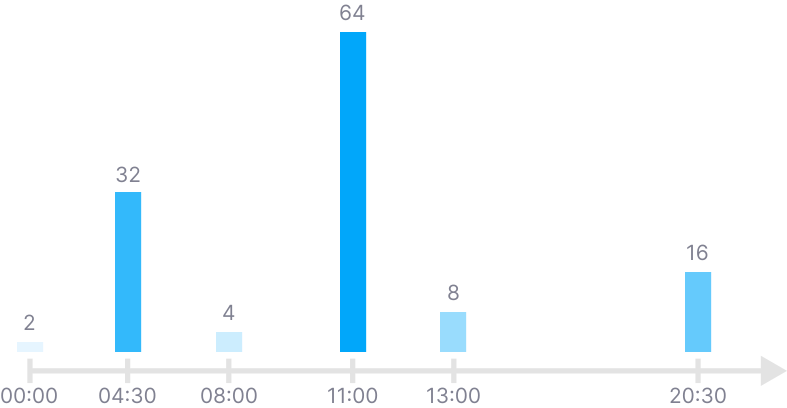

# Reward

Rewards are distributed in 30-minute time slots, with 48 slots per day. The reward for each slot is shared among all successful miners within that slot based on their block target difficulty and [mining coefficient](../advanced-mining/).

If the mining brand is a user-defined brand (not `endur.io`), the reward is determined by its campaign owner in the [Brand Market](../brand-market/).

<figure><figcaption></figcaption></figure>

## Boosted Slots

A day (starting with slot 48 × 𝑛) contains at most 12 boosted slots. Each boosted slot is calculated using the following formula to ensure a consistent mining schedule every day for a week:

```
48×n + KECCAK(n/7 | i) % 48
```

Boosted slots, which have significantly higher rewards, are designed to engage human miners and make mining bots less advantageous during the initial phase of the protocol. The mining reward for the 𝑖-th boosted slot is $$2^{6-i}$$ ENDU.

Thus, the rewards for boosted slots in a day will include:

* a 64x slot with 64 ENDU,
* a 32x slot with 32 ENDU,
* a 16x slot with 16 ENDU,
* a 8x slot with 8 ENDU,
* a 4x slot with 4 ENDU,
* and so on.

**Note:** Boosted slots of different rewards may collide, meaning some daily boosted rewards could be lost.

## Non-Boosted Slots

All slots other than the 12 boosted slots are considered non-boosted slots and have a mining reward of $$2^{-12}$$ ENDU.

## Development **Vault**

For each slot mined, an additional 1/32 of the slot's rewards is minted to the Development Vault, accounting for approximately 3% of the mining rewards.
